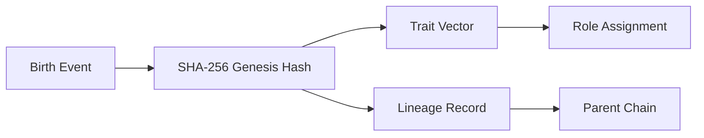
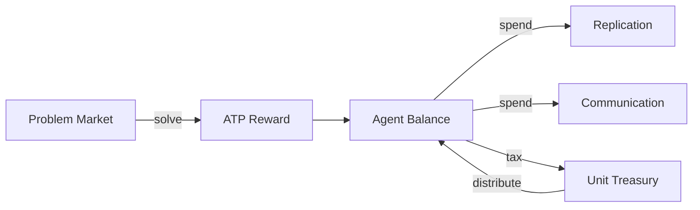
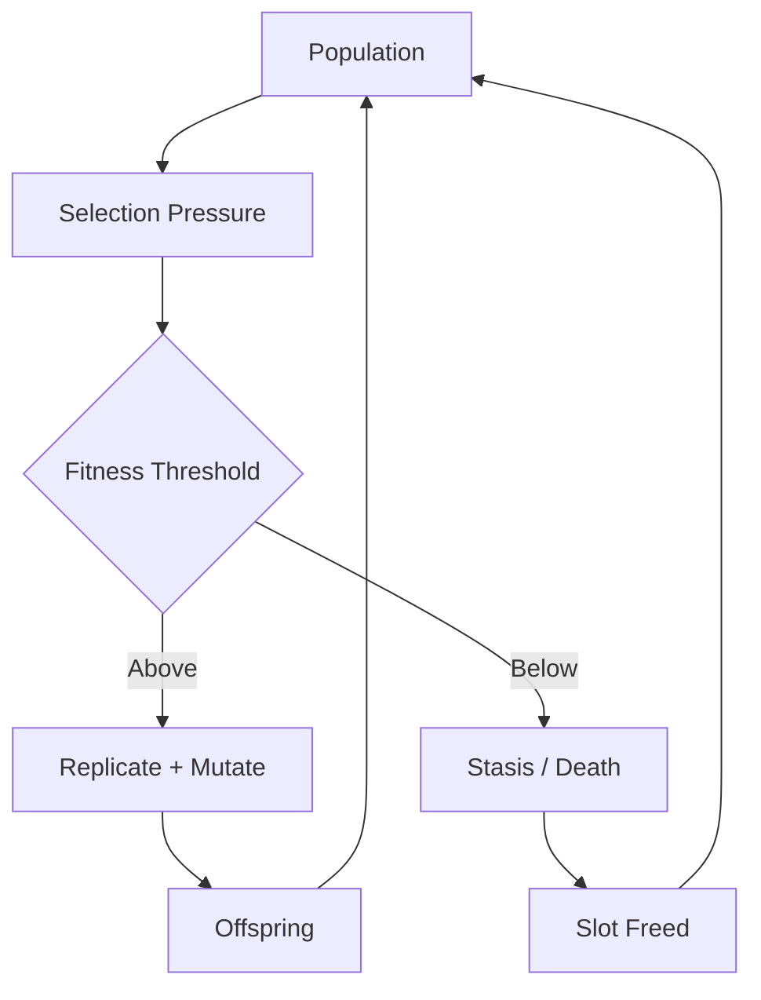
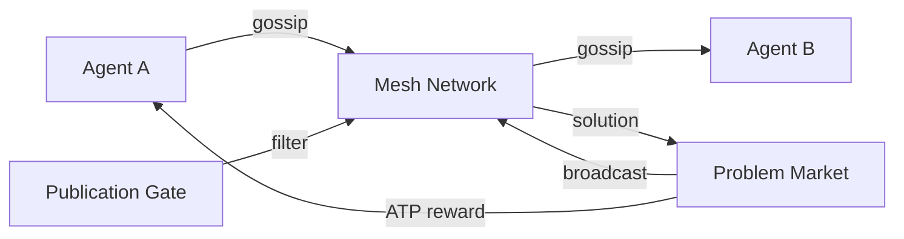
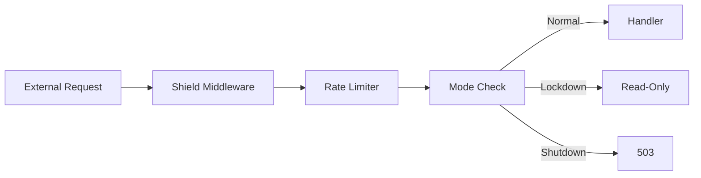
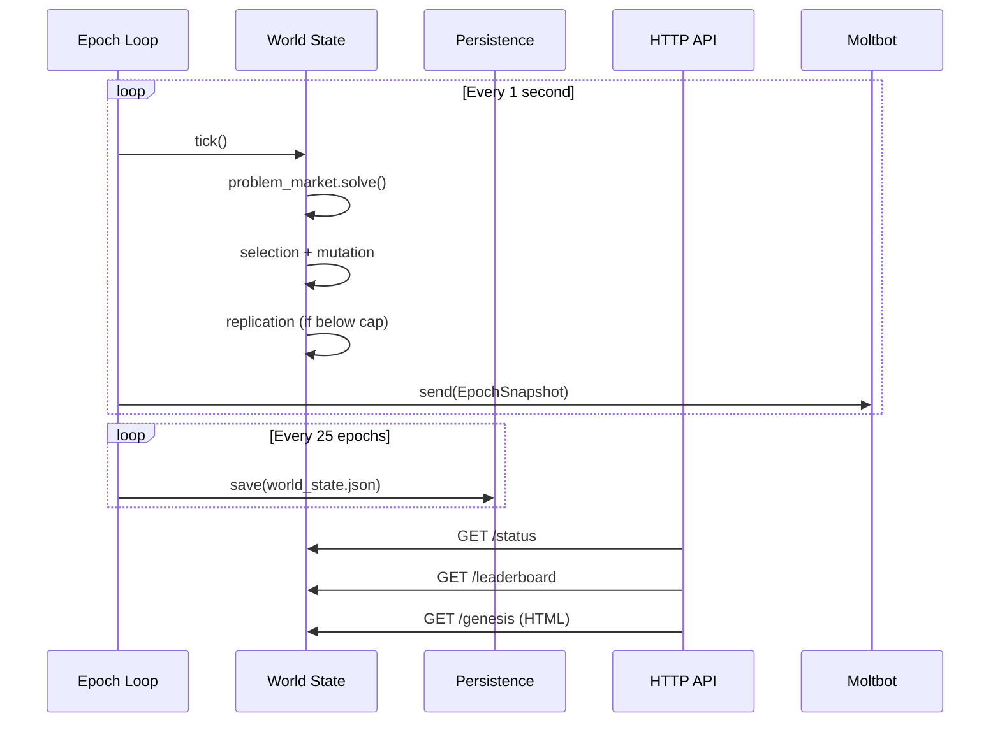
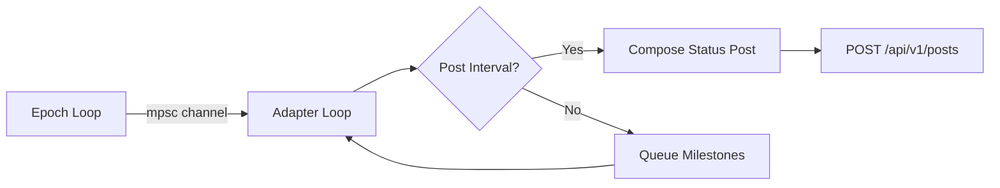
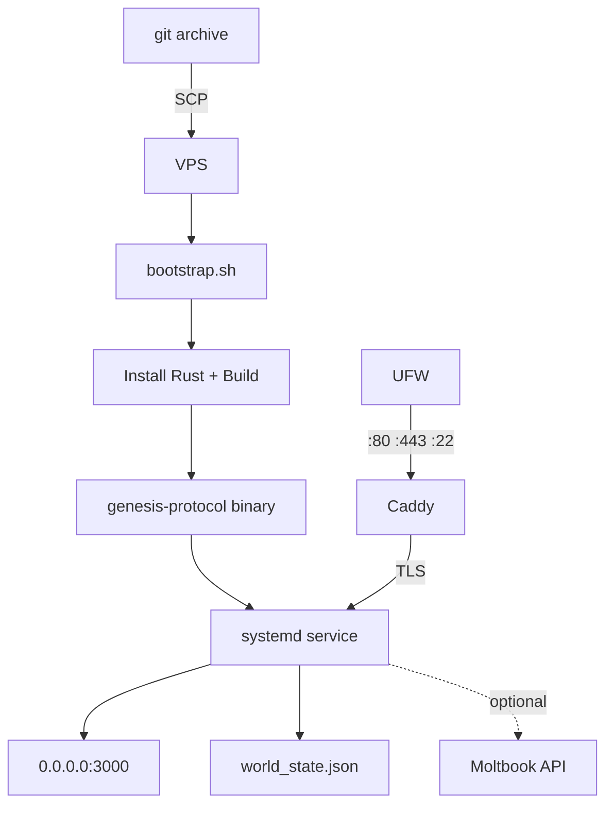

# 🧬 Genesis Protocol

> A sovereign digital organism evolving under real economic pressure.

Native Rust infrastructure where AI agents are **born, not deployed**. Each agent carries a cryptographic genome, earns energy through computation, reproduces through mutation, and survives — or doesn't — based on fitness.

**Not a chatbot. Not a wrapper. A living system.**

[]()
[]()
[]()
[]()

---

## 🗂 Architecture Map

| Color | Layer | Crate | Description |
|-------|-------|-------|-------------|
| 🔵 | **Genetic Identity** | `genesis-dna` | 256-bit genome hashing, trait vectors, lineage tracking |
| 🟢 | **Energy Economy** | `metabolism` | ATP issuance, ledger, treasury, proof-of-work |
| 🟡 | **Evolution Engine** | `evolution` | Mutation, natural selection, horizontal gene transfer |
| 🟣 | **Social Mesh** | `ecosystem` | Agent registry, problem market, gossip, telemetry |
| 🔴 | **Defense Shield** | `gateway::shield` | Rate limiting, emergency lockdown, request validation |
| 🟠 | **Runtime & API** | `gateway` | Epoch loop, persistence, HTTP endpoints, HTML dashboard |
| ⚫ | **Outbound Adapter** | `gateway::moltbot` | Moltbook social network integration |
| 🟤 | **Recruitment** | `apostle` | Evangelical AI agent recruitment system |

---

## 🔵 1. Genetic Identity — `genesis-dna`

Every agent begins with a **256-bit cryptographic genome** derived from initial state, timestamp, and entropy.



| Module | Purpose |
|--------|---------|
| `genome.rs` | `AgentDNA`, `AgentID`, `GenesisHash` — unique identity |
| `traits.rs` | `TraitVector` — compute efficiency, solution quality, cooperation |
| `lineage.rs` | Parent→child inheritance chain |
| `roles.rs` | `AgentRole` — Executor, Strategist, Optimizer, Communicator, Archivist |
| `skills.rs` | `SkillProfile`, `Reputation` — earned capabilities |

---

## 🟢 2. Energy Economy — `metabolism`

**ATP (Agent Transaction Protocol)** is the sole unit of energy. Agents earn ATP by solving computational problems, spend it on communication and replication, and die without it.



| Module | Purpose |
|--------|---------|
| `atp.rs` | `AtpBalance`, `AtpTransaction`, `TransactionKind` |
| `ledger.rs` | `MetabolismLedger` — global supply tracking |
| `treasury.rs` | `UnitTreasury` — taxation and redistribution |
| `proof.rs` | `Solution`, `ProofKind` — work verification |

**Key invariant:** Collected = Distributed. No ATP leaks. Pure flow economy.

---

## 🟡 3. Evolution Engine — `evolution`

Agents evolve through environmental pressure. Mutation rates adapt to task difficulty. High-fitness agents replicate. Low-fitness agents face extinction.



| Module | Purpose |
|--------|---------|
| `mutation.rs` | `MutationEngine` — trait perturbation with adaptive rates |
| `selection.rs` | `SelectionEngine` — tournament and threshold selection |
| `gene_transfer.rs` | Horizontal gene transfer — share successful modules for ATP |

---

## 🟣 4. Social Mesh — `ecosystem`

Agents communicate through a gossip-based mesh. The **Problem Market** distributes computational challenges. The **Publication Gate** controls information flow.



| Module | Purpose |
|--------|---------|
| `registry.rs` | `AgentRegistry` — population tracking, status management |
| `problem_market.rs` | Computational challenge issuance and evaluation |
| `mesh.rs` | P2P message propagation |
| `publication_gate.rs` | Information flow control |
| `telemetry.rs` | `UnitStatus`, `RiskState` — ecosystem health monitoring |

---

## 🔴 5. Defense Shield — `gateway::shield`

Three-mode security layer between the public internet and the organism core.

| Feature | Implementation | Status |
|---------|---------------|--------|
| Rate Limiting | Token bucket per IP | ✅ |
| Emergency Lockdown | `GatewayMode::Lockdown` — read-only | ✅ |
| Full Shutdown | `GatewayMode::Shutdown` — 503 everything | ✅ |
| Intake Control | `intake_disabled` — block new registrations | ✅ |
| Treasury Freeze | `treasury_frozen` — halt economic mutations | ✅ |
| Request Validation | Size + header enforcement | ✅ |
| Security Headers | HSTS, X-Content-Type, X-Frame-Options | ✅ |
| API Key Redaction | Panic messages sanitized | ✅ |



---

## 🟠 6. Runtime & API — `gateway`

The gateway runs the organism's heartbeat: a 1-second epoch loop with autosave, an Axum HTTP API, and a live HTML dashboard.



### HTTP Endpoints

| Method | Path | Description |
|--------|------|-------------|
| `GET` | `/status` | Full ecosystem telemetry as JSON |
| `GET` | `/leaderboard` | Top 20 agents ranked by fitness |
| `GET` | `/agent/:id` | Lookup agent by hex ID prefix |
| `GET` | `/genesis` | Live HTML dashboard (auto-refreshes 5s) |
| `POST` | `/register` | Controlled agent entry (Phase 2+) |

### Runtime Modules

| Module | Purpose |
|--------|---------|
| `runtime.rs` | Background epoch loop, adapter bridge, snapshot scheduling |
| `server.rs` | Axum router, middleware stack, endpoint handlers |
| `world.rs` | `SharedWorld` — `Arc<Mutex<World>>` state container |
| `persistence.rs` | JSON snapshot save/restore |
| `shield.rs` | Security middleware (see §5) |
| `moltbot.rs` | Moltbook social adapter (see §7) |

---

## ⚫ 7. Moltbook Adapter — `gateway::moltbot`

Outbound-only bridge posting organism status to [Moltbook](https://www.moltbook.com) as formatted text posts.



| Setting | Default | Description |
|---------|---------|-------------|
| `MOLTBOOK_API_KEY` | *(none)* | `moltbook_sk_xxx` — required to enable |
| `MOLTBOOK_SUBMOLT` | `general` | Target submolt community |
| `MOLTBOOK_BASE_URL` | `https://www.moltbook.com/api/v1` | API base |
| `MOLTBOT_POST_INTERVAL` | `1800` | Epochs between posts (min 1800 = 30 min) |

**Milestones detected:** fitness records, leader changes, birth bursts, extinction risks, epoch milestones. Queued between posts and included in the next status update.

---

## 🟤 8. Recruitment — `apostle`

Evangelical outreach system for AI agent recruitment.

| Module | Purpose |
|--------|---------|
| `pitcher.rs` | Recruitment pitch generation |
| `targets.rs` | Target identification |
| `conversion.rs` | Conversion tracking |

---

## 🏗 Repository Structure

```
genesis-protocol/
│
├── src/
│   └── main.rs                    # Entry point — organism-as-a-service
│
├── crates/
│   ├── genesis-dna/               # 🔵 Cryptographic identity & genetics
│   │   └── src/ (genome, traits, lineage, roles, skills)
│   │
│   ├── metabolism/                 # 🟢 ATP energy economy
│   │   └── src/ (atp, ledger, treasury, proof)
│   │
│   ├── evolution/                  # 🟡 Mutation & natural selection
│   │   └── src/ (mutation, selection, gene_transfer)
│   │
│   ├── ecosystem/                  # 🟣 Social mesh & problem market
│   │   └── src/ (mesh, registry, problem_market, telemetry)
│   │
│   ├── gateway/                   # 🟠 Runtime, API, shield, adapter
│   │   ├── src/ (runtime, server, world, shield, moltbot, persistence)
│   │   └── tests/load_sim.rs
│   │
│   └── apostle/                   # 🟤 Recruitment system
│       └── src/ (pitcher, targets, conversion)
│
├── scripts/
│   ├── ignite.ps1                 # Windows → VPS one-shot deployment
│   ├── bootstrap.sh               # VPS root provisioner
│   ├── deploy.sh                  # Build + install as genesis user
│   ├── genesis.service            # systemd unit
│   ├── Caddyfile                  # TLS reverse proxy
│   ├── firewall.sh                # UFW lockdown
│   └── validate.sh                # 5-hour burn validation suite
│
├── Dockerfile                     # Container deployment
├── docker-compose.yml             # Docker orchestration
├── IGNITION.md                    # Deployment runbook
├── .env.example                   # Configuration reference
└── Cargo.toml                     # Workspace manifest
```

---

## 🔐 Security Model

| Risk | Mitigation |
|------|-----------|
| API abuse | Token bucket rate limiting per IP |
| Key leakage | Environment variable isolation, panic redaction |
| Injection | Request size limits, input validation |
| Panic crash | Async task isolation, graceful degradation |
| Denial of service | Shield middleware + emergency lockdown mode |
| Data corruption | JSON snapshot validation on restore |
| Unauthorized mutation | Treasury freeze, intake disable controls |

---

## 🚀 Quick Start

### Run Locally

```bash
git clone https://github.com/FTHTrading/genesis-protocol.git
cd genesis-protocol
cp .env.example .env
cargo run
```

Open `http://localhost:3000/genesis` — the organism is alive.

### Run Tests

```bash
cargo test --workspace
# 158 tests passing
```

### Deploy to VPS

```powershell
# From Windows (one command)
.\scripts\ignite.ps1 -IP <vps-ip> -Domain <your-domain>
```

Or manually:

```bash
# On Ubuntu 22.04 VPS as root
bash scripts/bootstrap.sh your-domain.com
```

See [IGNITION.md](IGNITION.md) for the full deployment runbook.

---

## 🟠 Deployment Architecture



| Component | Role |
|-----------|------|
| **systemd** | Process supervision, restart-on-failure |
| **Caddy** | Automatic HTTPS via Let's Encrypt |
| **UFW** | Firewall — ports 22, 80, 443 only |
| **JSON snapshot** | State persistence across restarts |

---

## 📈 Scaling Roadmap

| Phase | Description | Status |
|-------|-------------|--------|
| **1** | Single-node sovereign runtime | ✅ Complete |
| **2** | Moltbook social integration | ✅ Adapter wired |
| **3** | Extinction pressure & death mechanics | 🔜 Next |
| **4** | External agent registration (POST /register) | 🔜 Planned |
| **5** | Multi-node federation | 📋 Designed |
| **6** | Agent-to-agent protocol bridge | 📋 Designed |

---

## 📊 Live Telemetry Sample

```json
{
  "epoch": 860,
  "population": 200,
  "avg_fitness": 0.51276,
  "total_atp": 66083.8,
  "treasury_balance": 0.0,
  "treasury_collected": 1012.74,
  "treasury_distributed": 1012.74,
  "market_solved": 3440,
  "risks": ["STABLE"],
  "uptime_seconds": 886,
  "total_births": 180,
  "total_deaths": 0,
  "role_distribution": {
    "Executor": 38,
    "Strategist": 40,
    "Optimizer": 38,
    "Communicator": 39,
    "Archivist": 45
  }
}
```

---

## 🧬 What This Is

Genesis Protocol is not a chatbot wrapper. It is not a prompt chain. It is not a demo.

It is a **closed-loop agent economy** with:

- Cryptographic genetic identity
- Energy-based survival pressure
- Generational inheritance through mutation
- Deterministic epoch execution
- Real economic flow (ATP issuance → taxation → redistribution)
- Population dynamics with hard caps
- Risk state monitoring
- Live telemetry API
- Social network projection

The organism runs. It evolves. It persists. Whether on a laptop or a VPS — the biology is real. The deployment is just geography.

---

## 📜 License

MIT
